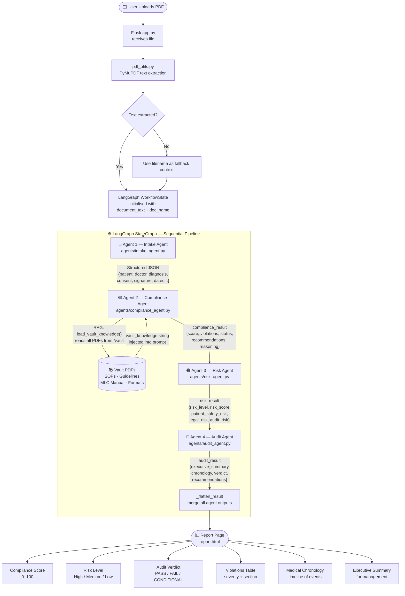
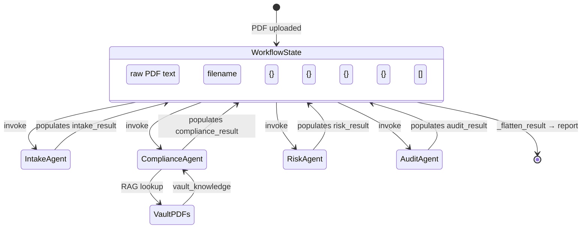
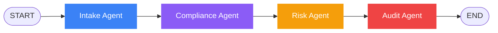
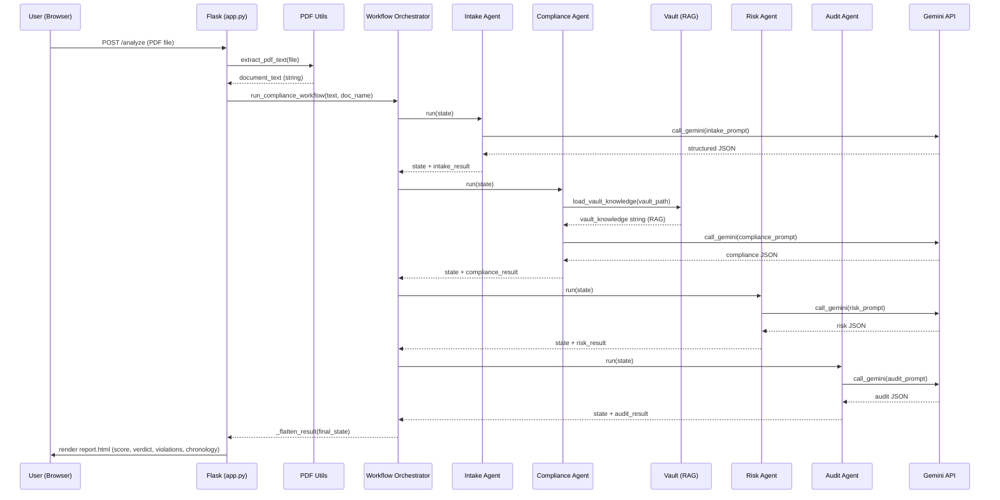

# legal AI 🏥
### Healthcare Compliance & Governance Intelligence Agent
**AgentCon 2026 — National AI Hackathon**
*Theme: Building Enterprise AI Agents, ML Systems & Workflow Automation for Bharat*

---

## The Problem

Indian hospitals spend hours manually reviewing medical documents before internal audits and regulatory inspections. A single discharge summary must be cross-checked against AIIMS SOPs, MLC protocols, assessment guidelines, and hospital policy — a process that is slow, error-prone, and leaves audit trails incomplete.

**MedComply AI** automates the entire compliance pipeline — upload a medical document, and a 4-agent LangGraph pipeline extracts structured data, checks it against a RAG-powered compliance knowledge base, assesses risk, and generates a board-ready audit report with PASS/FAIL verdict — in under 30 seconds.

---

## Architecture Overview

```
Browser (Flask Templates)
        │  HTTP POST — PDF upload
Flask App  (app.py · port 7000)
        │  calls
LangGraph Workflow Orchestrator  (agents/workflow.py)
        │  sequential state machine
   ┌────┴────────────────────────────────────────┐
   ▼                                             ▼
Agent 1          Agent 2          Agent 3       Agent 4
Intake    →   Compliance   →     Risk     →    Audit
Agent         Agent              Agent         Agent
   │              │                │              │
Extract       RAG lookup        Classify       Generate
entities      vs Vault          risk level     report
```

---

## 4-Agent LangGraph Pipeline — End to End



---

## Agent Deep Dive

### Agent 1 — Intake Agent
**File:** `agents/intake_agent.py`

**Goal:** Parse raw unstructured medical document text and return structured JSON entities.

**Input:** `state["document_text"]` — raw text from the uploaded PDF

**Process:**
1. Sends text (first 6000 chars) to Gemini with a strict JSON extraction prompt
2. Extracts: `patient_name`, `age`, `gender`, `doctor_name`, `hospital_name`, `admission_date`, `discharge_date`, `diagnosis[]`, `treatments[]`, `medicines[]`, `consent_present`, `signature_present`, `dates_present`, `document_type`, `extraction_confidence`
3. Cleans markdown fences from Gemini response
4. Falls back to a default structure if JSON parse fails

**Output:** `state["intake_result"]` — structured dict, confidence 0.0–1.0

**Example output:**
```json
{
  "patient_name": "Dummy Kumar",
  "doctor_name": "Dr. Sharma",
  "diagnosis": ["Fracture of right femur", "Minor head injury"],
  "consent_present": false,
  "extraction_confidence": 0.92
}
```

---

### Agent 2 — Compliance Intelligence Agent
**File:** `agents/compliance_agent.py`

**Goal:** Cross-reference the extracted document data against a RAG knowledge base of hospital SOPs and medical guidelines.

**Input:** `state["intake_result"]` + `state["document_text"]`

**RAG Process:**
1. Calls `load_vault_knowledge(VAULT_PATH)` from `utils/pdf_utils.py`
2. Walks all PDFs in `/vault` — AIIMS SOP Manual, Assessment Guidelines, Discharge Format, Motor Vehicles Act, Judgment PDFs
3. Extracts text from each PDF using PyMuPDF
4. Concatenates into a `vault_knowledge` string (up to 4000 chars)
5. Injects vault knowledge + intake data into compliance prompt

**Compliance Checks:**
- Missing informed consent
- Missing doctor signature
- Missing diagnosis
- Missing required sections
- Policy violations
- Documentation gaps

**Output:** `state["compliance_result"]`
```json
{
  "compliance_score": 45,
  "overall_status": "NON_COMPLIANT",
  "violations": [
    {"type": "MISSING_CONSENT", "severity": "HIGH", "section": "Consent Section", "description": "..."}
  ],
  "compliant_items": ["Patient identification present"],
  "recommendations": ["Obtain signed consent form"],
  "reasoning": "..."
}
```

---

### Agent 3 — Risk Assessment Agent
**File:** `agents/risk_agent.py`

**Goal:** Determine the overall risk level of the document based on compliance findings.

**Input:** `state["compliance_result"]` + `state["intake_result"]`

**Risk Dimensions Assessed:**
| Dimension | Description |
|---|---|
| Patient Safety Risk | Risk to patient from documentation gaps |
| Legal Risk | Liability exposure from missing consent / signatures |
| Audit Risk | Probability of failing a regulatory inspection |

**Risk Classification Logic:**
```
compliance_score < 40  OR  high_violations >= 3  →  HIGH RISK
compliance_score < 70  OR  high_violations >= 1  →  MEDIUM RISK
compliance_score >= 70 AND high_violations = 0   →  LOW RISK
```

**Output:** `state["risk_result"]`
```json
{
  "risk_level": "HIGH",
  "risk_score": 85,
  "patient_safety_risk": "HIGH",
  "legal_risk": "HIGH",
  "audit_risk": "MEDIUM",
  "risk_summary": "Document has 6 violations...",
  "immediate_actions": ["Obtain signed consent", "Add doctor countersignature"]
}
```

---

### Agent 4 — Audit Report Agent
**File:** `agents/audit_agent.py`

**Goal:** Synthesise all previous agent outputs into a complete, board-ready audit report.

**Input:** All three previous agent results + original document text

**Output Structure:**
```json
{
  "executive_summary": "3-4 sentence summary for hospital management",
  "medical_chronology": [
    {"date": "2024-03-12", "event": "Patient Admission", "significance": "clinical"}
  ],
  "compliance_report": {
    "score": 45,
    "status": "NON_COMPLIANT",
    "key_findings": [...]
  },
  "risk_report": {"level": "HIGH", "critical_issues": [...]},
  "recommendations": [
    {"priority": "IMMEDIATE", "action": "...", "rationale": "..."}
  ],
  "audit_verdict": "FAIL",
  "next_audit_date": "3 months"
}
```

**Verdict Logic:**
```
score >= 80  →  PASS
score >= 60  →  CONDITIONAL_PASS
score < 60   →  FAIL
```

---

## State Flow Diagram



---

## RAG Knowledge Base (Vault)

The compliance agent reads from `/vault` — a curated set of medical compliance PDFs:

| File | Category | Used For |
|---|---|---|
| `sop-manual-for-mlcs-aiimsk-fmt.pdf` | Medical Rules | AIIMS MLC SOP standards |
| `assessment_guidelines (1).pdf` | Medical Rules | Disability & injury assessment protocols |
| `D.-E-Mitra_FORMAT-04_Hospital-Discharge-Summary-Format.pdf` | Templates | Required discharge summary sections |
| `motor vehcle act.pdf` | Laws | MV Act sections for MACT cases |
| `AWARDINMOTORACCIDENTCASES.pdf` | Judgments | Precedents for award computation |

All vault PDFs are loaded at compliance-check time via PyMuPDF and injected into the Gemini prompt as grounding context.

---

## LangGraph Orchestration



The workflow is built as a `StateGraph(WorkflowState)` with typed state passing. If LangGraph is not installed, the system falls back to a pure sequential Python pipeline — same agents, same output, no orchestration overhead.

---

## Data Flow — Sequence Diagram



---

## Project Structure

```
medcompliance/
├── app.py                    # Flask app — routes, session, file handling
├── agents/
│   ├── llm.py                # Shared Gemini wrapper — loads key from .env
│   ├── intake_agent.py       # Agent 1 — entity extraction
│   ├── compliance_agent.py   # Agent 2 — RAG compliance check
│   ├── risk_agent.py         # Agent 3 — risk classification
│   ├── audit_agent.py        # Agent 4 — audit report generation
│   └── workflow.py           # LangGraph StateGraph orchestrator
├── utils/
│   └── pdf_utils.py          # PyMuPDF text extraction + vault loader
├── templates/
│   ├── landing.html          # Landing page (dark maroon theme)
│   ├── base.html             # Shared nav + styles
│   ├── dashboard.html        # Reports dashboard
│   ├── analyze.html          # Upload form + progress
│   └── report.html           # Full audit report view
├── vault/
│   ├── medical_rules/        # SOP manuals, assessment guidelines
│   ├── medical_templates/    # Hospital discharge formats
│   ├── laws/                 # Motor Vehicles Act
│   └── judgments/            # MACT award judgments
├── uploads/                  # Temp PDF storage (gitignored)
├── docs/                     # PRD, system design, team plan
├── .gitignore                # Blocks .env, __pycache__, uploads
└── readme1.md                # This file
```

---

## Setup & Run

### 1. Clone the repo
```bash
git clone https://github.com/Kunalkandke/Nights_Watch_AgentCon.git
cd Nights_Watch_AgentCon
```

### 2. Install dependencies
```bash
pip install flask google-generativeai PyMuPDF langgraph
```

### 3. Configure API key
Create a `.env` file in the `medcompliance/` folder:
```bash
# medcompliance/.env
GEMINI_API_KEY=your_gemini_api_key_here
```
Get a free key at: https://aistudio.google.com/app/apikey

### 4. Run the app
```bash
cd medcompliance
python app.py
```

Open **http://127.0.0.1:7000**

---

## Pages

| URL | Description |
|---|---|
| `/` | Landing page — project overview |
| `/dashboard` | Compliance reports dashboard |
| `/analyze` | Upload a medical PDF |
| `/report/<id>` | Full audit report for a document |
| `/api/analyze` | JSON API endpoint |

---

## Tech Stack

| Layer | Technology |
|---|---|
| Orchestration | LangGraph `StateGraph` |
| AI Model | Gemini 2.5 Flash → 1.5 Flash (fallback) |
| PDF Processing | PyMuPDF (fitz) |
| RAG Source | Vault PDFs (5 curated documents) |
| Backend | Flask (Python) |
| Frontend | Jinja2 templates + inline CSS |
| Knowledge Base | AIIMS SOPs · MLC Manual · Assessment Guidelines |

---

## Hackathon Criteria Coverage

| Criteria | Implementation |
|---|---|
| ✅ AI Agents | 4 specialised agents with distinct goals, inputs, outputs |
| ✅ Agentic Workflow | LangGraph `StateGraph` with typed state |
| ✅ Workflow Automation | End-to-end: upload → audit report, zero manual steps |
| ✅ Decision Support | PASS/FAIL verdict + prioritised recommendations |
| ✅ Enterprise Intelligence | Compliance scoring, risk classification, executive summary |
| ✅ RAG | Vault PDFs loaded and injected into compliance prompt |
| ✅ Multi-Agent Collaboration | 4 agents share and enrich a single `WorkflowState` |
| ✅ LangGraph | `StateGraph` with nodes + edges + sequential execution |

---

## Team — Nights Watch

Built at **AgentCon 2026** | July 16, 2026
