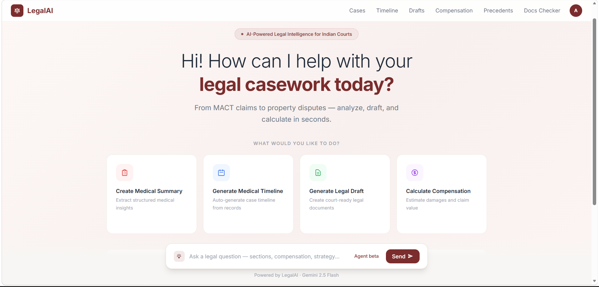
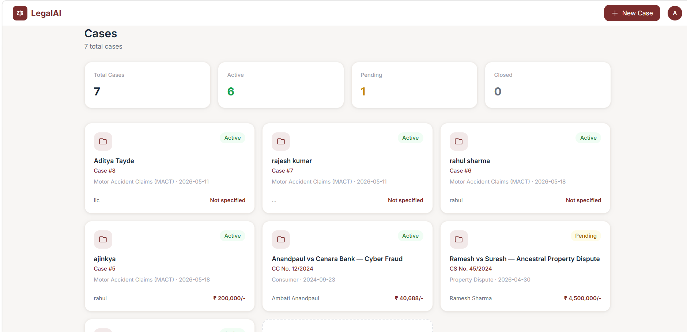
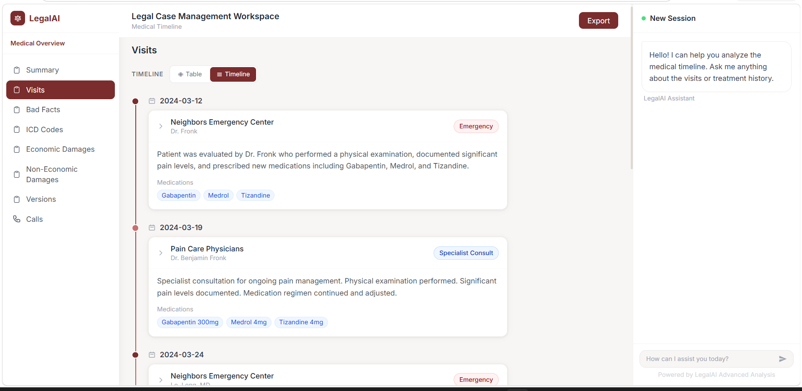
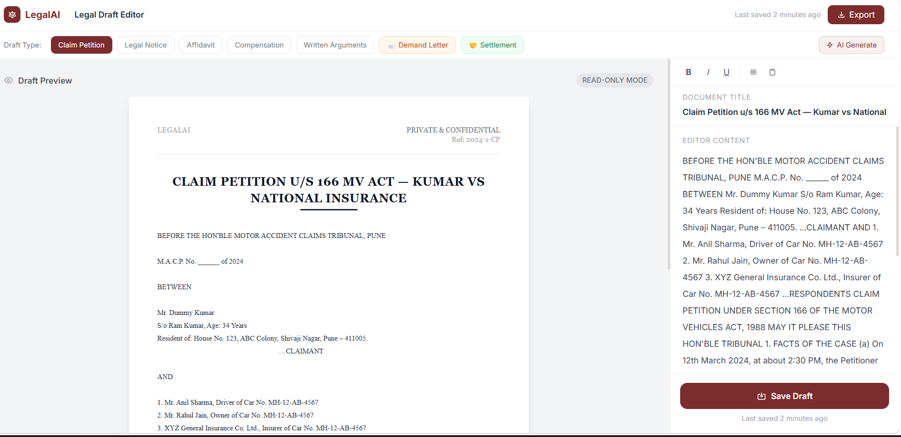
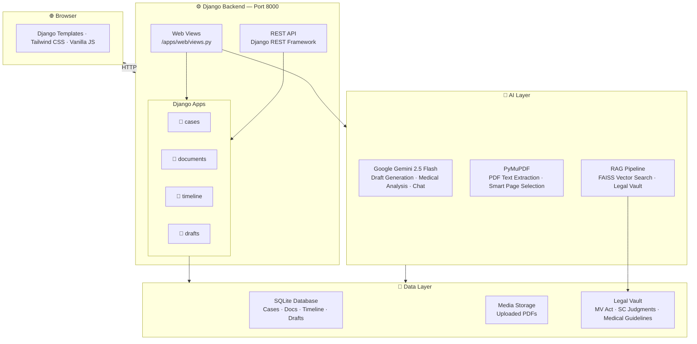
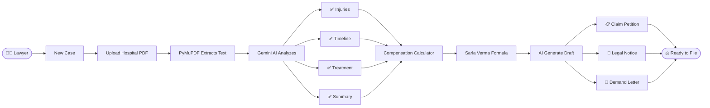
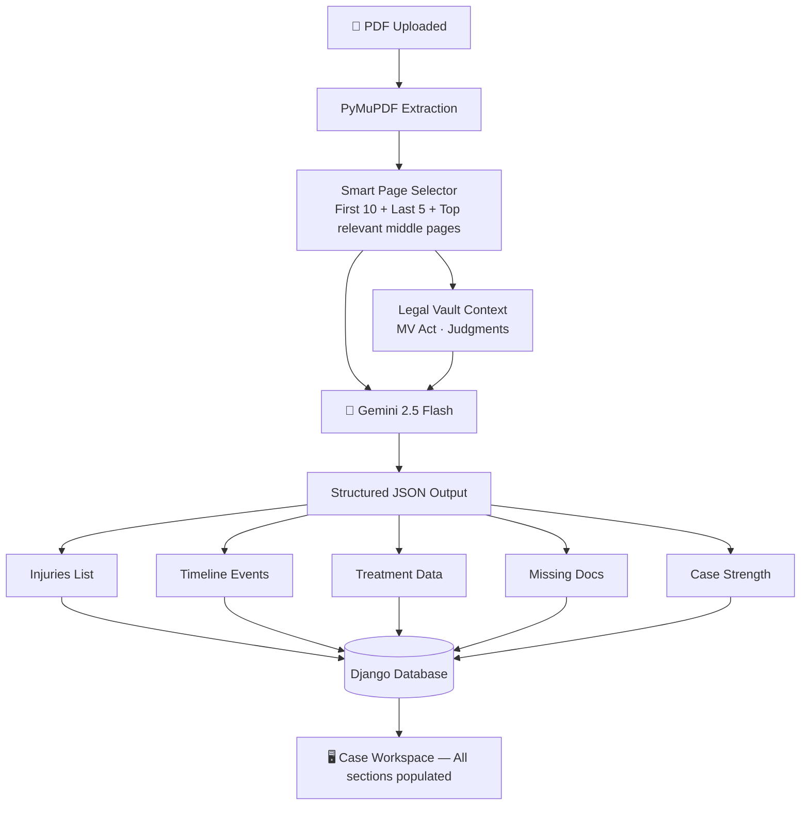
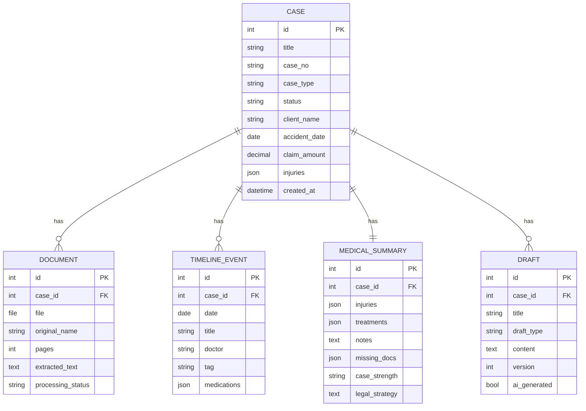

<div align="center">

<!-- PROJECT LOGO & BANNER -->


# ⚖️ AI-Powered medical complience for LEGAL Industry 

### *AI-Powered medical complience for LEGAL Industry *

<br/>

[](https://python.org)
[](https://djangoproject.com)
[](https://django-rest-framework.org)
[](https://deepmind.google/gemini/)
[](https://pymupdf.readthedocs.io)
[](https://sqlite.org)
[](https://tailwindcss.com)
[](LICENSE)
[]()
[]()

<br/>

> **Empowering Indian lawyers with AI-driven document analysis, medical timeline generation, compensation calculation, and court-ready draft generation — all in seconds.**

<br/>

[🚀 Quick Start](#-quick-start) · [📖 API Docs](#-api-documentation) · [🐛 Report Bug](../../issues) · [✨ Request Feature](../../issues)

---

</div>

## 📸 Screenshots

<div align="center">

### 🏠 Dashboard — AI-Powered Case Intelligence
> *Central hub with action cards, live stats, AI Q&A bar, and recent cases*



<br/>

### 📁 Cases — Case Management Grid
> *All cases in one view with status badges, filters, and quick stats*



<br/>

### 🏥 Medical Timeline — Auto-Generated from PDF
> *Hospital visits extracted and organised with tags, doctors, medications*



<br/>

### 📝 Legal Draft Editor — 7 Document Types
> *Split A4 preview + rich-text editor with AI generation in 60 seconds*



</div>

---

## 🎯 Problem & Solution

<table>
<tr>
<td width="50%">

### ❌ The Problem

Indian MACT lawyers spend **60-70% of their time on paperwork**:

- 📄 Reading 200-page hospital records manually
- ✍️ Writing court documents from scratch per case
- 🔢 Calculating compensation by hand
- 📅 Building medical timelines laboriously
- 📋 Missing critical documents found only in court
- 🔍 Hours spent finding relevant precedents

**A single MACT case = 2–3 days of prep work.**

</td>
<td width="50%">

### ✅ The Solution

LegalAI automates the entire pre-filing workflow:

- 🤖 **AI reads hospital PDFs** → structured report in 30s
- 📅 **Auto-generates timeline** from uploaded records
- 📝 **Generates 7 court document types** in 60s
- 💰 **Calculates compensation** with Sarla Verma formula
- 📋 **Tracks 17 required documents** per case
- ⚖️ **Finds SC & HC precedents** with compensation ranges

**Same case prep in under 5 minutes.**

</td>
</tr>
</table>

---

## 🏗️ System Architecture



---

## 🔄 Complete User Journey



---

## 🤖 AI Pipeline



---

## 🗄️ Database Schema



---

## ✨ Features

<details>
<summary><b>📁 Case Management</b></summary>

- ✅ Create MACT, Property, Consumer, Criminal, Civil cases
- ✅ Upload PDFs with automatic text extraction
- ✅ Status tracking (Active / Pending / Closed)
- ✅ Dashboard with real-time statistics
- ✅ Search and filter by type, status, client

</details>

<details>
<summary><b>🏥 Medical Analysis (AI)</b></summary>

- ✅ Upload hospital PDFs → structured medical report in 30s
- ✅ Auto-extracts injuries, ICD codes, dates
- ✅ Medical chronology (admission → surgery → discharge)
- ✅ Treatment summary with medicines and rehabilitation
- ✅ Smart extraction — picks most relevant 40 pages from 500-page files
- ✅ Handles up to 100MB PDFs

</details>

<details>
<summary><b>📅 Medical Timeline</b></summary>

- ✅ Auto-generated from uploaded records
- ✅ Tags: Emergency, Specialist, Surgery, Chiropractic, Physiotherapy, Discharge
- ✅ Timeline and Table view toggle
- ✅ Medications per visit

</details>

<details>
<summary><b>📝 Legal Draft Generator</b></summary>

- ✅ 7 document types with one-click AI generation
  - Claim Petition (u/s 166 MV Act)
  - Legal Notice to Insurance Company
  - Affidavit of Claimant
  - Statement of Compensation
  - Written Arguments (with Sarla Verma formula)
  - Demand Letter to Insurance Company
  - Settlement / Compromise Letter
- ✅ Split A4 preview + rich text editor
- ✅ Version history (each save preserved)
- ✅ Auto-save every 30 seconds

</details>

<details>
<summary><b>💰 Compensation Calculator</b></summary>

- ✅ Sarla Verma multiplier table (Supreme Court formula)
- ✅ Instant calculation: age × multiplier × income × disability %
- ✅ All heads: medical, income loss, pain & suffering, disability, amenities
- ✅ AI detailed analysis with SC/HC citations (Pranay Sethi, Raj Kumar)

</details>

<details>
<summary><b>🔍 Precedent Finder</b></summary>

- ✅ Search SC & High Court MACT judgments
- ✅ Filter by injury type, location, victim age, income
- ✅ Compensation range analysis (min/max/recommended)
- ✅ Legal strategy recommendations

</details>

<details>
<summary><b>📋 Missing Documents Checker</b></summary>

- ✅ 17-document MACT checklist across 6 categories
- ✅ Status: Received / Missing / Pending / N/A
- ✅ Filing readiness progress bar
- ✅ AI auto-identifies missing documents from case analysis
- ✅ Saved in localStorage per case

</details>

<details>
<summary><b>🤖 AI Chat Assistant</b></summary>

- ✅ Case-aware — AI knows full case details
- ✅ Ask sections, compensation, strategy, document checklist
- ✅ Chat history persistent in session
- ✅ Available on every case page (right sidebar)

</details>

---

## 🛠️ Technology Stack

| Category | Technology | Version | Purpose |
|----------|-----------|---------|---------|
| **Language** | Python | 3.12 | Core backend |
| **Web Framework** | Django | 6.0.4 | MVC, ORM, templates |
| **REST API** | Django REST Framework | 3.17.1 | JSON API endpoints |
| **AI Model** | Google Gemini 2.5 Flash | Latest | Generation, analysis, chat |
| **PDF Processing** | PyMuPDF (fitz) | 1.27 | Text extraction |
| **Database** | SQLite → PostgreSQL | 3 | Data persistence |
| **Frontend** | Django Templates | — | Server-rendered UI |
| **CSS** | Tailwind CSS | CDN | Styling |
| **JavaScript** | Vanilla JS | ES2020 | AJAX, interactions |
| **RAG** | FAISS + HuggingFace | Latest | Semantic vault search |
| **CORS** | django-cors-headers | 4.9.0 | Cross-origin requests |
| **PDF Gen** | ReportLab + fpdf | Latest | Legal document export |

---

## 🚀 Quick Start

### Prerequisites

```bash
Python 3.12+   # Required
pip            # Python package manager
Git            # Version control
```

### Installation

```bash
# 1. Clone
git clone https://github.com/YOUR_USERNAME/legalai.git
cd legalai

# 2. Install core dependencies
pip install django djangorestframework django-cors-headers PyMuPDF google-generativeai

# 3. Run database migrations
python backend/manage.py migrate

# 4. Create admin user
python backend/create_admin.py
# → Username: admin  Password: admin123

# 5. Load demo data (optional)
python backend/seed_data.py

# 6. Start server
python backend/manage.py runserver 8000
```

### Access

| URL | Description |
|-----|-------------|
| http://127.0.0.1:8000 | Main application |
| http://127.0.0.1:8000/dashboard/ | Dashboard |
| http://127.0.0.1:8000/admin/ | Admin panel |
| http://127.0.0.1:8000/api/ | REST API browser |
| http://127.0.0.1:8000/api/health/ | Health check |

### Environment Variables

```python
# backend/legalai/settings.py

# Replace with your Gemini API key
# Get free key at: https://aistudio.google.com/app/apikey
GEMINI_API_KEY = "your-gemini-api-key-here"

# Database (SQLite for dev, PostgreSQL for prod)
DATABASES = {
    "default": {
        "ENGINE": "django.db.backends.sqlite3",
        "NAME": BASE_DIR / "db.sqlite3",
    }
}
```

---

## 📁 Project Structure

```
legalai/
├── 📁 backend/
│   ├── 📁 apps/
│   │   ├── 📁 cases/           # Case model + REST API
│   │   ├── 📁 documents/       # PDF upload + PyMuPDF extraction
│   │   ├── 📁 timeline/        # Medical timeline + AI summary
│   │   ├── 📁 drafts/          # Draft generation + versioning
│   │   └── 📁 web/             # HTML page views + AJAX endpoints
│   ├── 📁 legalai/
│   │   ├── settings.py         # Configuration + API keys
│   │   └── urls.py             # Root URL routing
│   ├── db.sqlite3              # SQLite database
│   └── manage.py               # Django CLI
│
├── 📁 templates/               # Django HTML templates
│   ├── base.html               # Master layout + Tailwind config
│   ├── dashboard.html          # Main dashboard
│   ├── case_workspace.html     # 3-panel case view
│   ├── draft_editor.html       # Split draft editor
│   ├── compensation.html       # Sarla Verma calculator
│   ├── precedent_finder.html   # Case law search
│   ├── missing_docs.html       # Document checklist
│   └── 📁 includes/
│       ├── case_sidebar.html   # Shared sidebar
│       └── case_chat.html      # Shared AI chat panel
│
├── 📁 vault/                   # Legal knowledge base
│   ├── 📁 judgments/           # MACT SC/HC judgments
│   ├── 📁 laws/                # Motor Vehicles Act
│   └── 📁 medical_rules/       # Medical assessment guidelines
│
├── 📁 DRAFT GENERATOR/         # Standalone ReportLab scripts
├── rag.py                      # FAISS RAG pipeline
└── README.md
```

---

## 🔌 API Documentation

### Cases API

| Method | Endpoint | Description |
|--------|----------|-------------|
| `GET` | `/api/cases/` | List all cases |
| `POST` | `/api/cases/` | Create case |
| `GET` | `/api/cases/{id}/` | Case details |
| `GET` | `/api/cases/stats/` | Dashboard stats |
| `GET` | `/api/cases/{id}/summary/` | Case with counts |

### Documents API

| Method | Endpoint | Description |
|--------|----------|-------------|
| `POST` | `/api/documents/upload/` | Upload PDF + auto-extract |
| `POST` | `/api/documents/process/` | Re-process document |

### Timeline & AI API

| Method | Endpoint | Description |
|--------|----------|-------------|
| `GET` | `/api/timeline/?case_id=X` | Timeline events |
| `POST` | `/api/timeline/summary/generate/` | Generate AI medical summary |

### Drafts API

| Method | Endpoint | Description |
|--------|----------|-------------|
| `POST` | `/api/drafts/generate/` | AI-generate legal draft |
| `PUT` | `/api/drafts/{id}/` | Save draft |
| `GET` | `/api/drafts/{id}/versions/` | Version history |

### AJAX Endpoints

| Method | Endpoint | Description |
|--------|----------|-------------|
| `POST` | `/api/chat/` | AI chat with case context |
| `POST` | `/api/analyze-case/` | Trigger full AI analysis |
| `GET` | `/api/health/` | System health check |

---

## 🗺️ Roadmap

### ✅ Completed
- [x] Case management with PDF upload
- [x] Medical timeline auto-generation
- [x] 7 AI-generated draft types (incl. Demand Letter, Settlement)
- [x] Compensation calculator (Sarla Verma formula)
- [x] Precedent finder (SC/HC judgments)
- [x] Missing documents checker (17-document checklist)
- [x] AI chat assistant with case context
- [x] Smart PDF extraction (50K chars from 500-page files)
- [x] Auto AI analysis on PDF upload

### 🔜 In Progress
- [ ] OCR for scanned PDFs (Gemini Vision)
- [ ] Proper RAG with FAISS vector search
- [ ] Pydantic output validation
- [ ] User authentication (register/login)

### 📋 Planned
- [ ] Cloud deployment (DigitalOcean)
- [ ] PostgreSQL for production
- [ ] Async processing (Celery + Redis)
- [ ] Subscription billing (Razorpay — ₹999/month)
- [ ] Multi-tenancy (law firm accounts)
- [ ] Hearing date tracker with reminders
- [ ] Fine-tuned model on 1000+ MACT judgments

---


---

## 📄 License

MIT License — see [LICENSE](LICENSE) for details.

---

## 👤 Author


---

<div align="center">

### ⭐ Star this repository if you found it useful

[](../../stargazers)
[](../../network/members)

---


</div>
