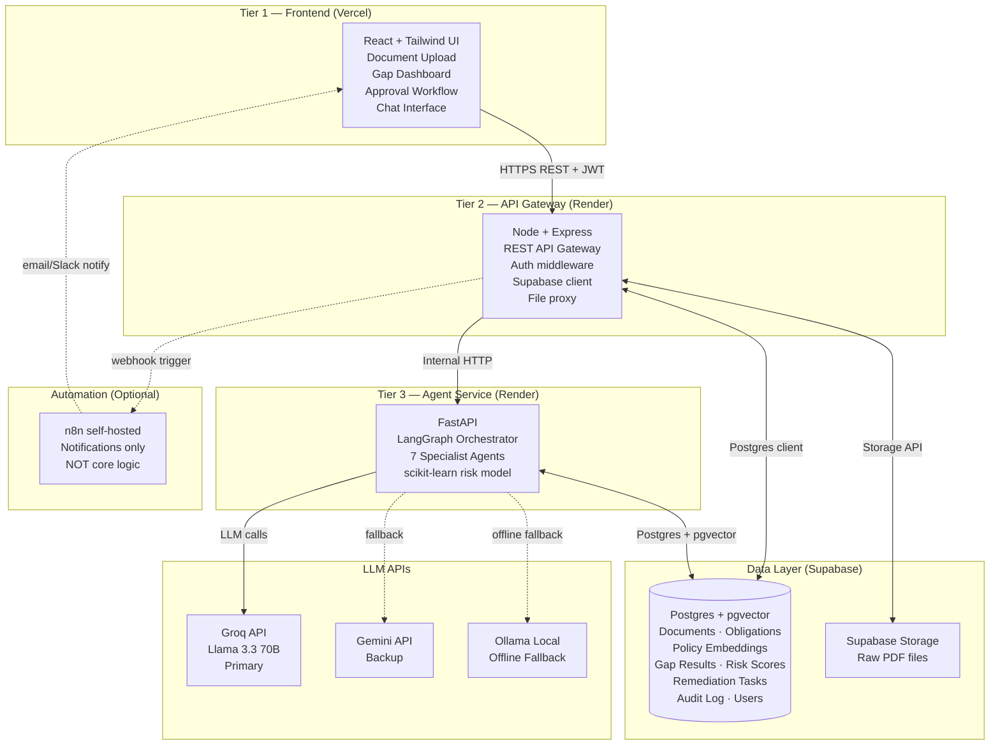
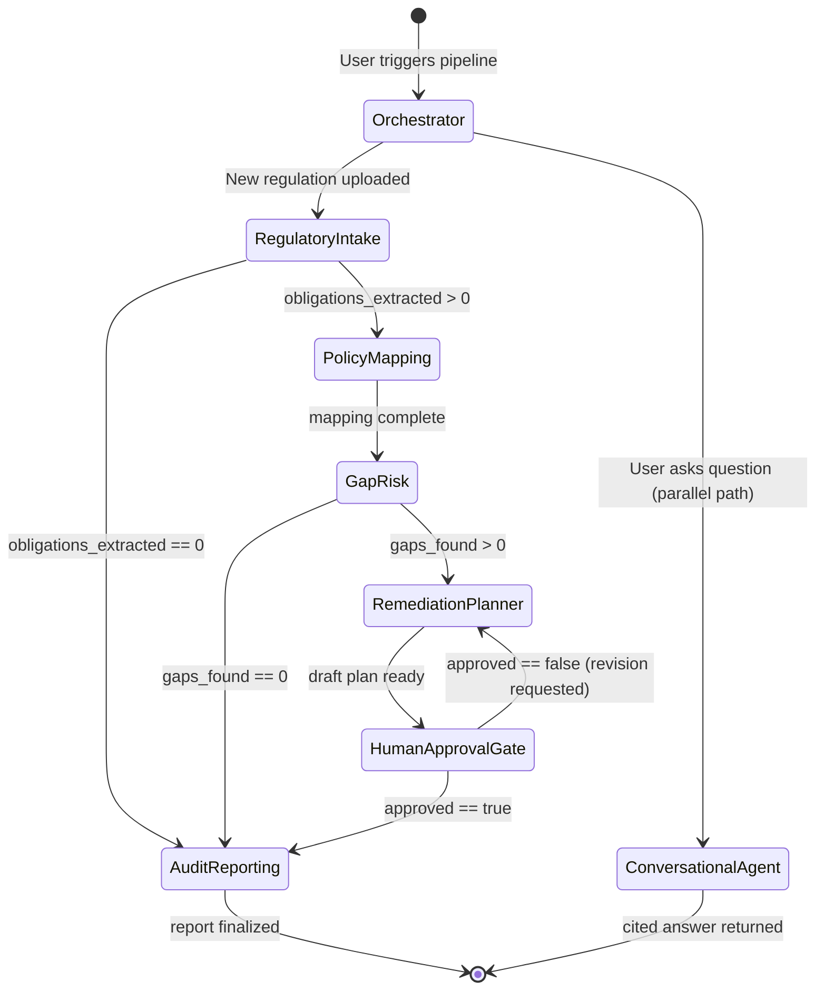
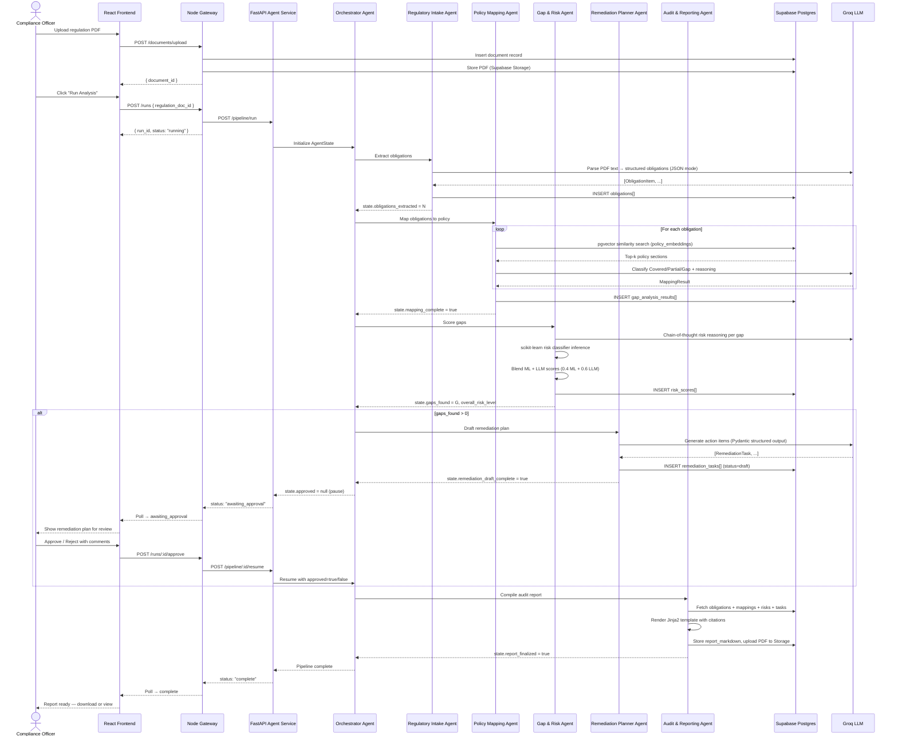

# System Design Document
## Compliance & Governance Intelligence Agent — Nights Watch
**Version:** 1.0 | **Date:** July 16, 2026

---

## 1. High-Level Architecture

Three-tier architecture: React frontend → Node/Express API gateway → FastAPI agent service, sharing a single Supabase Postgres (+ pgvector) data layer.



**Trade-off note:** Supabase pgvector vs. a dedicated vector DB (Pinecone/Weaviate) — pgvector collocates vector and relational data, eliminating a second free-tier service and keeping joins cheap. The trade-off is that pgvector query performance degrades beyond ~1M vectors; acceptable for hackathon and early-stage production scale.

---

## 2. Agent Architecture — LangGraph State Graph



### Agent Descriptions

| Agent | Responsibility | Key Tools / Libs |
|---|---|---|
| **Orchestrator / Supervisor** | Routes tasks, maintains `AgentState`, decides next node based on state flags | LangGraph `StateGraph`, conditional edges |
| **Regulatory Intake Agent** | Parses PDF → extracts structured obligations (clause ID, obligation text, regulation section, effective date, applicability) | PyMuPDF, Groq LLM (structured output / JSON mode) |
| **Policy Mapping Agent** | RAG retrieval over internal policy embeddings; classifies each obligation as Covered / Partial / Gap | LangChain retriever, pgvector similarity search, Groq LLM |
| **Gap & Risk Agent** | Assigns risk level (Critical / High / Medium / Low) and numeric score (0–100) per gap; hybrid LLM reasoning + scikit-learn classifier | scikit-learn `RandomForestClassifier`, Groq LLM chain-of-thought |
| **Remediation Planner Agent** | Drafts action items with suggested owner role, recommended deadline, and remediation steps per gap | Groq LLM, structured Pydantic output |
| **Audit & Reporting Agent** | Assembles citation-traced Markdown report; links every claim to `(regulation_id, clause_id)` and `(policy_doc_id, section_id)` | Jinja2 template, WeasyPrint / markdown export |
| **Conversational Agent** | Cited Q&A over full knowledge base (regulations + policies); returns answer + source citations | LangChain ConversationalRetrievalChain, pgvector, Groq LLM |

---

## 3. Data Flow Diagram

```mermaid
flowchart LR
    A([User uploads\nregulation PDF]) --> B[Node Gateway\nstores file →\nSupabase Storage]
    B --> C[FastAPI\ntriggers pipeline]
    C --> D[Regulatory Intake Agent\nPyMuPDF parse\nLLM extraction]
    D --> E[(obligations table\nSupabase Postgres)]
    E --> F[Policy Mapping Agent\nEmbed each obligation\npgvector similarity search]
    F --> G[(policy_embeddings\ntable — pgvector)]
    G --> H[LLM classifies\nCovered / Partial / Gap]
    H --> I[(gap_analysis_results\ntable)]
    I --> J[Gap & Risk Agent\nscikit-learn scorer\n+ LLM reasoning]
    J --> K[(risk_scores table)]
    K --> L{gaps_found > 0?}
    L -- Yes --> M[Remediation Planner\nDraft action items]
    M --> N[(remediation_tasks\ntable)]
    N --> O[Human Approval Gate\nUI review + approve/reject]
    O -- Approved --> P[Audit & Reporting Agent\nAssemble cited report]
    L -- No --> P
    P --> Q[(audit_reports table\n+ Storage PDF)]
    Q --> R([User downloads\nreport])
```



---

## 4. Shared State Schema

This is the exact typed `TypedDict` object that LangGraph agents read from and write to. All agents receive the full state; each agent only mutates its designated fields.

```python
from typing import TypedDict, Optional, Literal
from datetime import datetime

class ObligationItem(TypedDict):
    obligation_id: str              # UUID
    clause_id: str                  # e.g. "RBI/2024/Section-3.2"
    regulation_id: str              # FK → documents.id
    obligation_text: str
    applicability: str              # e.g. "NBFC", "All banks"
    effective_date: Optional[str]   # ISO date string

class MappingResult(TypedDict):
    obligation_id: str
    status: Literal["Covered", "Partial", "Gap"]
    matched_policy_doc_id: Optional[str]
    matched_policy_section: Optional[str]
    similarity_score: float         # 0.0–1.0 from pgvector cosine
    llm_reasoning: str

class RiskScore(TypedDict):
    obligation_id: str
    risk_level: Literal["Critical", "High", "Medium", "Low"]
    numeric_score: float            # 0–100
    ml_score: float                 # scikit-learn raw probability
    llm_score: float                # LLM chain-of-thought derived
    final_score: float              # weighted blend: 0.4*ml + 0.6*llm
    explanation: str

class RemediationTask(TypedDict):
    task_id: str                    # UUID
    obligation_id: str
    action_description: str
    suggested_owner_role: str       # e.g. "Chief Compliance Officer"
    recommended_deadline_days: int
    priority: Literal["Critical", "High", "Medium", "Low"]
    status: Literal["draft", "approved", "rejected", "in_progress", "done"]

class AuditCitation(TypedDict):
    regulation_id: str
    clause_id: str
    policy_doc_id: Optional[str]
    policy_section: Optional[str]
    assessment: str

class AgentState(TypedDict):
    # ── Input ──────────────────────────────────────────────
    run_id: str                                 # UUID for this pipeline run
    user_id: str
    regulation_doc_id: str                      # FK → documents.id
    regulation_text: str                        # full extracted text

    # ── Regulatory Intake ──────────────────────────────────
    obligations: list[ObligationItem]
    obligations_extracted: int                  # len(obligations), used for routing

    # ── Policy Mapping ─────────────────────────────────────
    mapping_results: list[MappingResult]
    mapping_complete: bool

    # ── Gap & Risk ─────────────────────────────────────────
    risk_scores: list[RiskScore]
    gaps_found: int                             # count of Gap+Partial items
    overall_risk_level: Literal["Critical", "High", "Medium", "Low"]

    # ── Remediation ────────────────────────────────────────
    remediation_tasks: list[RemediationTask]
    remediation_draft_complete: bool

    # ── Human Approval Gate ────────────────────────────────
    approved: Optional[bool]                    # None = pending, True/False = decided
    reviewer_id: Optional[str]
    review_comments: Optional[str]
    reviewed_at: Optional[str]                  # ISO datetime

    # ── Audit Report ───────────────────────────────────────
    audit_citations: list[AuditCitation]
    report_markdown: Optional[str]
    report_storage_url: Optional[str]           # Supabase Storage URL
    report_finalized: bool

    # ── Conversational Agent (parallel path) ───────────────
    user_question: Optional[str]
    conversation_history: list[dict]            # [{role, content, citations}]

    # ── Metadata / Error handling ──────────────────────────
    current_agent: str
    errors: list[str]
    started_at: str                             # ISO datetime
    completed_at: Optional[str]
```

---

## 5. Database Schema (Supabase Postgres)

```sql
-- ── Users (managed by Supabase Auth, extended) ───────────────────────────
create table public.user_profiles (
    id           uuid primary key references auth.users(id) on delete cascade,
    full_name    text,
    org_name     text,
    role         text check (role in ('admin','compliance_officer','auditor','viewer')),
    created_at   timestamptz default now()
);

-- ── Documents (regulations + internal policies) ───────────────────────────
create table public.documents (
    id             uuid primary key default gen_random_uuid(),
    user_id        uuid references public.user_profiles(id),
    doc_type       text check (doc_type in ('regulation','policy')),
    title          text not null,
    source_name    text,                        -- e.g. "RBI", "SEBI", "Internal HR Policy"
    storage_path   text,                        -- Supabase Storage path
    status         text check (status in ('uploaded','processing','processed','failed')),
    page_count     int,
    uploaded_at    timestamptz default now(),
    processed_at   timestamptz
);

-- ── Extracted Obligations ─────────────────────────────────────────────────
create table public.obligations (
    id              uuid primary key default gen_random_uuid(),
    regulation_id   uuid references public.documents(id) on delete cascade,
    run_id          uuid,
    clause_id       text,
    obligation_text text not null,
    applicability   text,
    effective_date  date,
    extracted_at    timestamptz default now()
);

-- ── Policy Embeddings (pgvector) ──────────────────────────────────────────
create extension if not exists vector;

create table public.policy_embeddings (
    id            uuid primary key default gen_random_uuid(),
    policy_doc_id uuid references public.documents(id) on delete cascade,
    section_id    text,                         -- e.g. "Section 4.1"
    section_text  text not null,
    embedding     vector(1536),                 -- Groq/Ollama embedding dim
    created_at    timestamptz default now()
);

create index on public.policy_embeddings
    using ivfflat (embedding vector_cosine_ops)
    with (lists = 100);

-- ── Gap Analysis Results ──────────────────────────────────────────────────
create table public.gap_analysis_results (
    id                   uuid primary key default gen_random_uuid(),
    run_id               uuid,
    obligation_id        uuid references public.obligations(id) on delete cascade,
    status               text check (status in ('Covered','Partial','Gap')),
    matched_policy_doc_id uuid references public.documents(id),
    matched_policy_section text,
    similarity_score     float,
    llm_reasoning        text,
    created_at           timestamptz default now()
);

-- ── Risk Scores ───────────────────────────────────────────────────────────
create table public.risk_scores (
    id              uuid primary key default gen_random_uuid(),
    run_id          uuid,
    obligation_id   uuid references public.obligations(id) on delete cascade,
    risk_level      text check (risk_level in ('Critical','High','Medium','Low')),
    numeric_score   float check (numeric_score between 0 and 100),
    ml_score        float,
    llm_score       float,
    final_score     float,
    explanation     text,
    created_at      timestamptz default now()
);

-- ── Remediation Tasks ─────────────────────────────────────────────────────
create table public.remediation_tasks (
    id                      uuid primary key default gen_random_uuid(),
    run_id                  uuid,
    obligation_id           uuid references public.obligations(id) on delete cascade,
    action_description      text not null,
    suggested_owner_role    text,
    recommended_deadline_days int,
    priority                text check (priority in ('Critical','High','Medium','Low')),
    status                  text check (status in ('draft','approved','rejected','in_progress','done'))
                            default 'draft',
    assigned_to             uuid references public.user_profiles(id),
    due_date                date,
    created_at              timestamptz default now(),
    updated_at              timestamptz default now()
);

-- ── Pipeline Runs ─────────────────────────────────────────────────────────
create table public.pipeline_runs (
    id                  uuid primary key default gen_random_uuid(),
    user_id             uuid references public.user_profiles(id),
    regulation_doc_id   uuid references public.documents(id),
    status              text check (status in ('running','awaiting_approval','approved','complete','failed')),
    overall_risk_level  text,
    gaps_found          int,
    approved            boolean,
    reviewer_id         uuid references public.user_profiles(id),
    review_comments     text,
    reviewed_at         timestamptz,
    started_at          timestamptz default now(),
    completed_at        timestamptz
);

-- ── Audit Reports ─────────────────────────────────────────────────────────
create table public.audit_reports (
    id              uuid primary key default gen_random_uuid(),
    run_id          uuid references public.pipeline_runs(id) on delete cascade,
    report_markdown text,
    storage_url     text,                       -- Supabase Storage URL for PDF
    finalized_at    timestamptz default now()
);

-- ── Audit Log (immutable append-only event trail) ─────────────────────────
create table public.audit_log (
    id          bigserial primary key,
    run_id      uuid,
    user_id     uuid references public.user_profiles(id),
    event_type  text,                           -- e.g. "obligation_extracted", "gap_identified", "report_approved"
    entity_type text,                           -- e.g. "obligation", "report"
    entity_id   uuid,
    payload     jsonb,
    created_at  timestamptz default now()
);
-- No UPDATE/DELETE allowed on audit_log — enforced via RLS policy
```

---

## 6. API Contract

### 6.1 Node/Express Public API (port 3000, deployed on Render)

Base URL: `https://nights-watch-api.onrender.com/api/v1`

All authenticated endpoints require `Authorization: Bearer <supabase_jwt>`.

---

#### Authentication

| Method | Path | Description |
|---|---|---|
| `POST` | `/auth/signup` | Register new user |
| `POST` | `/auth/login` | Login, returns Supabase JWT |

---

#### Documents

```
POST   /documents/upload
  Content-Type: multipart/form-data
  Body: { file: <PDF>, doc_type: "regulation"|"policy", title: string, source_name?: string }
  Response 201: { document_id: uuid, status: "uploaded" }

GET    /documents
  Query: ?doc_type=regulation|policy&page=1&limit=20
  Response 200: { documents: Document[], total: int }

GET    /documents/:id
  Response 200: Document

DELETE /documents/:id
  Response 204
```

---

#### Pipeline Runs

```
POST   /runs
  Body: { regulation_doc_id: uuid }
  Response 202: { run_id: uuid, status: "running" }

GET    /runs
  Query: ?page=1&limit=20
  Response 200: { runs: PipelineRun[], total: int }

GET    /runs/:id
  Response 200: PipelineRun (full state snapshot)

POST   /runs/:id/approve
  Body: { approved: boolean, comments?: string }
  Response 200: { run_id: uuid, status: "approved"|"rejected" }
```

---

#### Reports

```
GET    /reports/:run_id
  Response 200: { run_id, report_markdown, storage_url, finalized_at }

GET    /reports/:run_id/download
  Response 200: application/pdf (streamed from Supabase Storage)
```

---

#### Chat

```
POST   /chat
  Body: { question: string, conversation_history?: [{role, content}] }
  Response 200: { answer: string, citations: Citation[], conversation_history: [...] }
```

---

### 6.2 FastAPI Internal Agent Service (port 8000, internal only)

Base URL: `http://agent-service:8000` (internal Render network)

Not exposed publicly. Called only by the Node gateway.

---

```
POST   /pipeline/run
  Body: {
    run_id: uuid,
    user_id: uuid,
    regulation_doc_id: uuid,
    regulation_text: string
  }
  Response 202: { run_id: uuid, message: "pipeline started" }
  Note: Pipeline runs async; state persisted to Supabase. Gateway polls /pipeline/{run_id}/status.

GET    /pipeline/{run_id}/status
  Response 200: {
    run_id: uuid,
    current_agent: string,
    status: "running"|"awaiting_approval"|"complete"|"failed",
    gaps_found: int,
    overall_risk_level: string,
    errors: string[]
  }

POST   /pipeline/{run_id}/resume
  Body: { approved: boolean, reviewer_id: uuid, comments?: string }
  Response 200: { run_id: uuid, status: "resuming" }
  Note: Unblocks the HumanApprovalGate node in the LangGraph graph.

POST   /chat/query
  Body: {
    question: string,
    conversation_history: [{role: string, content: string}],
    user_id: uuid
  }
  Response 200: {
    answer: string,
    citations: [{ doc_id, doc_title, section_id, clause_text }],
    conversation_history: [...]
  }

POST   /embeddings/index
  Body: { policy_doc_id: uuid, sections: [{ section_id, section_text }] }
  Response 200: { indexed: int, doc_id: uuid }

GET    /health
  Response 200: { status: "ok", llm_provider: "groq"|"gemini"|"ollama" }
```

---

## 7. Sequence Diagram — Full Pipeline



---

## 8. Non-Functional Requirements

### 8.1 Explainability & Citation Requirement

Every gap classification, risk score, and remediation item in the final report **must** carry a citation object of the form:

```json
{
  "regulation_id": "uuid",
  "clause_id": "RBI/2024/MD-Section-3.2",
  "policy_doc_id": "uuid",
  "policy_section": "HR Policy v2.1 — Section 4",
  "assessment": "Gap: Obligation requires 90-day breach notification; policy only mandates 30 days."
}
```

This is non-negotiable for audit defensibility and is enforced at the `AuditReportingAgent` layer by validating that `len(audit_citations) == len(obligations)` before marking `report_finalized = true`.

### 8.2 Human Approval Gate

The LangGraph graph has a hard interrupt after `RemediationPlannerAgent`. The `approved` field in `AgentState` starts as `None`. The `AuditReportingAgent` node will only execute if `approved is True`. No remediation task can transition from `draft` to any other status without an explicit `POST /runs/:id/approve` call from an authenticated user.

### 8.3 Latency Expectations

| Stage | Expected Latency |
|---|---|
| PDF parse + obligation extraction (20-page doc) | 15–30s (LLM bounded) |
| Policy mapping (10 obligations × RAG + LLM) | 20–40s |
| Risk scoring (10 gaps) | 10–20s |
| Remediation drafting (10 tasks) | 15–25s |
| Report compilation | 2–5s |
| **Total pipeline (cold start)** | **~2–3 minutes** |
| Conversational Q&A | < 5s per query |

### 8.4 Free-Tier Resource Constraints & Mitigations

| Constraint | Risk | Mitigation |
|---|---|---|
| **Groq free tier:** ~30 req/min, ~6K tokens/min | Rate limit hit during live demo | Exponential backoff with jitter; batch obligation processing; Gemini API as hot standby; Ollama local as offline fallback |
| **Render free tier:** 512MB RAM, spins down after 15min inactivity | Cold start (~30s) surprises judges during demo | Keep-alive ping from n8n every 10 min; demo starts with a "warm-up" call |
| **Supabase free tier:** 500MB Postgres, 1GB Storage | Storage exhaustion during demo | Limit demo to 3–5 documents; compress PDFs before upload; pgvector index uses `ivfflat` (not HNSW) to reduce index size |
| **Vercel:** 100GB bandwidth/month | Not a concern for hackathon demo | N/A |
| **scikit-learn model size** | Large model file adds cold-start latency | Use lightweight `RandomForestClassifier` (≤5 features, max_depth=4); pickle file < 1MB |

### 8.5 Security Considerations (MVP)

- All Supabase tables have Row Level Security (RLS) enabled; users only see their own runs and documents
- JWT validation at Node gateway on every authenticated request
- PDF uploads validated for MIME type and size (max 50MB) before storage
- No secrets committed to public repo; all credentials via environment variables
- FastAPI internal service not exposed to public internet
