# MedComply AI 🏥
### Healthcare Compliance & Governance Intelligence Agent
**AgentCon 2026 — National AI Hackathon**
*Theme: Building Enterprise AI Agents, ML Systems & Workflow Automation for Bharat*

---

## The Problem

Indian hospitals spend hours manually reviewing medical documents before internal audits and regulatory inspections. A single discharge summary must be cross-checked against AIIMS SOPs, MLC protocols, assessment guidelines, and hospital policy — slow, error-prone, and leaves audit trails incomplete.

**MedComply AI** automates the entire compliance pipeline — upload a medical document, and a 4-agent LangGraph pipeline extracts structured data, checks it against a RAG-powered knowledge base, assesses risk, and generates a board-ready audit report with PASS/FAIL verdict — in under 30 seconds.

---

## Screenshots

### Compliance Dashboard
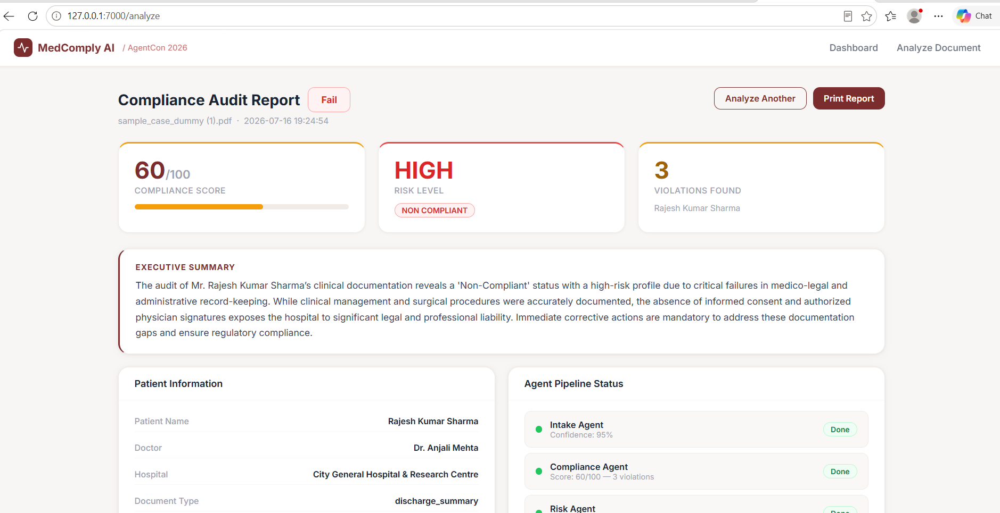

### Compliance Audit Report — Top Section
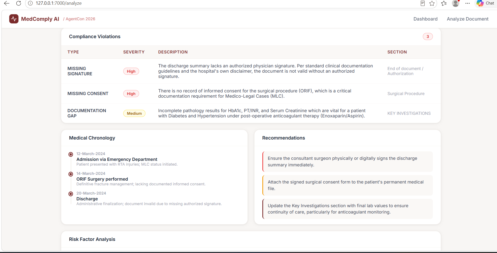

### Full Report — Violations & Recommendations
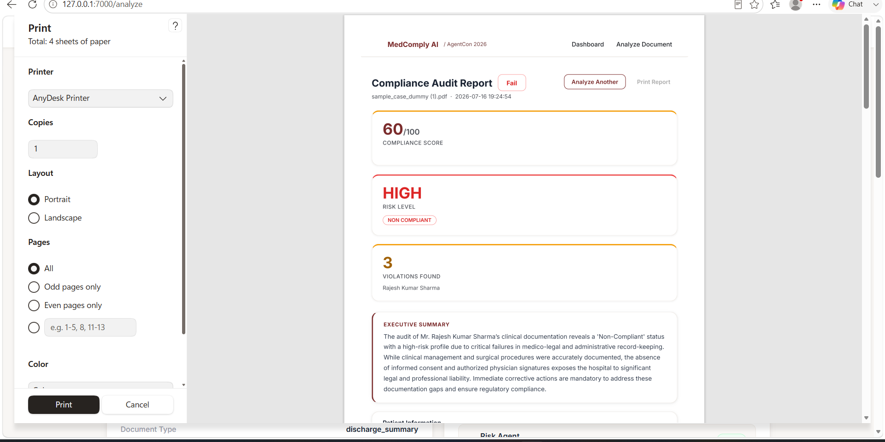

---

## System Architecture

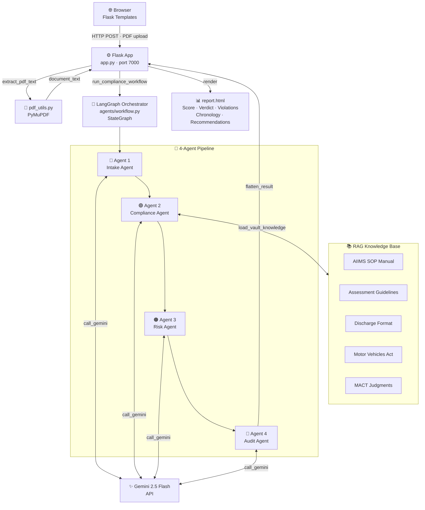

---

## 4-Agent Pipeline — End to End Flow

```mermaid
flowchart TD
    START(["📎 User Uploads PDF"]) --> EXTRACT["PyMuPDF\nextract_pdf_text()"]
    EXTRACT --> CHECK{Text\nextracted?}
    CHECK -- No --> FALLBACK["Use filename\nas context"]
    CHECK -- Yes --> INIT
    FALLBACK --> INIT

    INIT["Initialize WorkflowState\ndocument_text · doc_name\nintake_result · compliance_result\nrisk_result · audit_result · agent_log"] --> AG1

    subgraph PIPELINE ["⚙️ LangGraph StateGraph"]
        direction TB

        AG1["🔵 AGENT 1\nIntake Agent\n─────────────────\nGoal: Extract entities\nfrom raw document text\n─────────────────\nPrompt → Gemini\nReturns: structured JSON"]

        AG1 -->|"intake_result ✓\npatient · doctor · diagnosis\nconsent · signature · confidence"| AG2

        AG2["🟣 AGENT 2\nCompliance Agent\n─────────────────\nGoal: RAG check vs SOPs\nand medical guidelines\n─────────────────\nLoads vault PDFs → Gemini\nReturns: score + violations"]

        AG2 -->|"compliance_result ✓\nscore · status · violations\nmissing_items · recommendations"| AG3

        AG3["🟠 AGENT 3\nRisk Agent\n─────────────────\nGoal: Classify risk level\nfrom compliance findings\n─────────────────\nPrompt → Gemini\nReturns: HIGH/MEDIUM/LOW"]

        AG3 -->|"risk_result ✓\nrisk_level · patient_safety\nlegal_risk · audit_risk"| AG4

        AG4["🔴 AGENT 4\nAudit Agent\n─────────────────\nGoal: Generate full\naudit report\n─────────────────\nPrompt → Gemini\nReturns: verdict + summary"]
    end

    AG4 -->|"audit_result ✓\nverdict · chronology\nexecutive_summary"| FLATTEN

    FLATTEN["_flatten_result()\nmerge all 4 outputs"] --> REPORT

    subgraph REPORT ["📊 Report Output"]
        direction LR
        R1["Compliance Score\n0 – 100"]
        R2["Risk Level\nHigh / Medium / Low"]
        R3["Audit Verdict\nPASS / FAIL / CONDITIONAL"]
        R4["Violations Table\ntype · severity · section"]
        R5["Medical Chronology\ntimeline of events"]
        R6["Executive Summary\nfor management"]
    end
```

---

## Agent State Flow

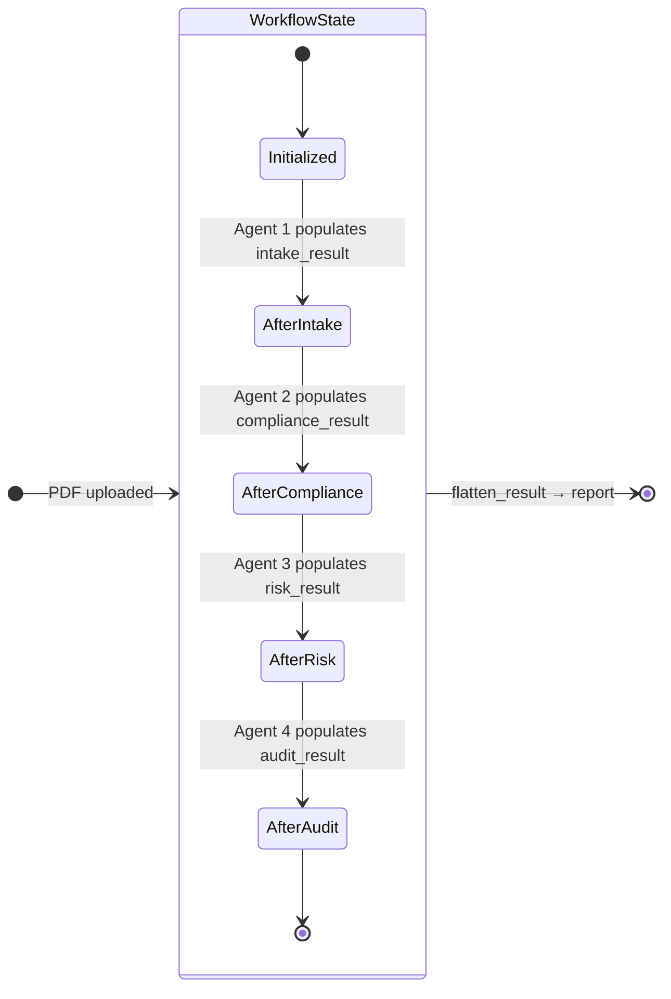

---

## Agent 1 — Intake Agent

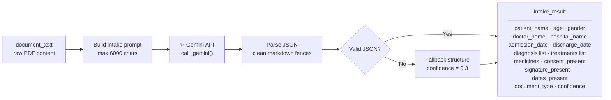

**Example output:**
```json
{
  "patient_name": "Dummy Kumar",
  "doctor_name": "Dr. Sharma",
  "hospital_name": "City Hospital",
  "diagnosis": ["Fracture of right femur", "Minor head injury"],
  "consent_present": false,
  "signature_present": false,
  "extraction_confidence": 0.92
}
```

---

## Agent 2 — Compliance Agent (RAG)

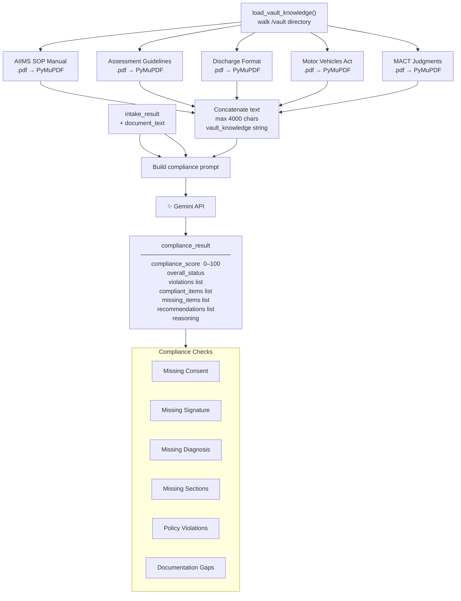

---

## Agent 3 — Risk Assessment Agent

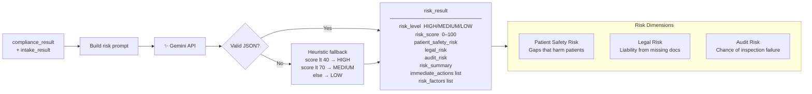

---

## Agent 4 — Audit Report Agent

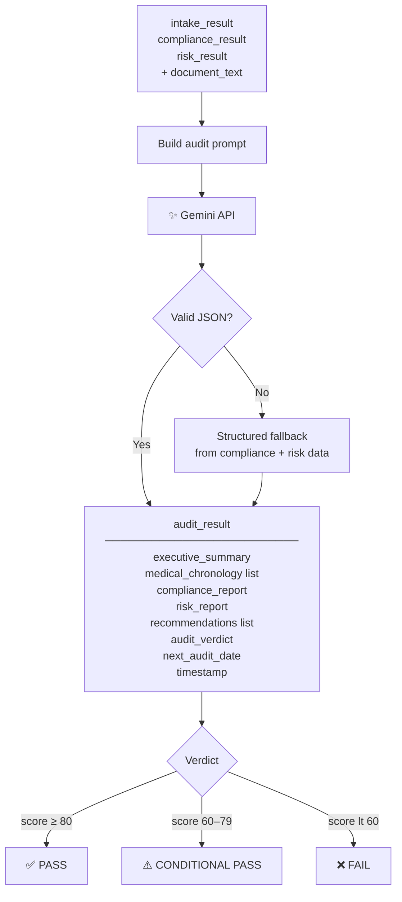

---

## Full Sequence Diagram

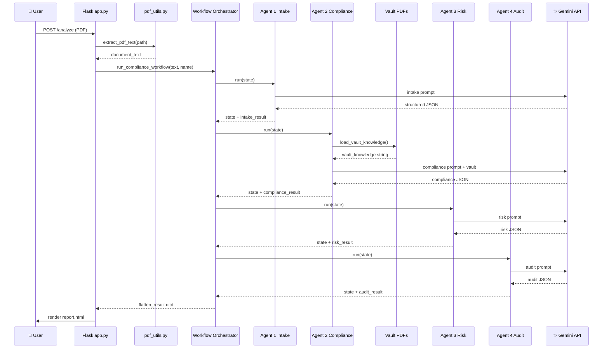

---

## LangGraph Graph

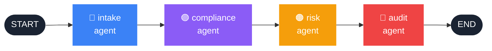

---

## RAG Knowledge Base

| # | File | Category | Used For |
|---|---|---|---|
| 1 | `sop-manual-for-mlcs-aiimsk-fmt.pdf` | Medical Rules | AIIMS MLC SOP — required documentation standards |
| 2 | `assessment_guidelines (1).pdf` | Medical Rules | Disability & injury assessment protocols |
| 3 | `D.-E-Mitra_FORMAT-04_Hospital-Discharge-Summary-Format.pdf` | Templates | Required sections in discharge summaries |
| 4 | `motor vehcle act.pdf` | Laws | MV Act sections for MACT compliance |
| 5 | `AWARDINMOTORACCIDENTCASES.pdf` | Judgments | Precedents for compensation computation |

---

## Project Structure

```
medcompliance/
├── app.py                     Flask app — routes, session, .env loading
├── agents/
│   ├── llm.py                 Gemini wrapper — loads key from .env, model fallback
│   ├── intake_agent.py        Agent 1 — entity extraction
│   ├── compliance_agent.py    Agent 2 — RAG compliance check
│   ├── risk_agent.py          Agent 3 — risk classification
│   ├── audit_agent.py         Agent 4 — audit report generation
│   └── workflow.py            LangGraph StateGraph orchestrator
├── utils/
│   └── pdf_utils.py           PyMuPDF extraction + vault loader
├── templates/
│   ├── landing.html           Landing page (dark maroon)
│   ├── base.html              Nav + shared styles
│   ├── dashboard.html         Reports dashboard
│   ├── analyze.html           Upload form + agent progress
│   └── report.html            Full audit report view
├── vault/
│   ├── medical_rules/         SOP manuals · assessment guidelines
│   ├── medical_templates/     Hospital discharge formats
│   ├── laws/                  Motor Vehicles Act
│   └── judgments/             MACT award judgments
├── uploads/                   Temp PDF storage (gitignored)
├── docs/                      PRD · System Design · Team Plan
├── .gitignore                 Blocks .env · __pycache__ · uploads
└── readme1.md                 This file
```

---

## Setup & Run

### 1. Clone
```bash
git clone https://github.com/Kunalkandke/Nights_Watch_AgentCon.git
cd Nights_Watch_AgentCon
```

### 2. Install
```bash
pip install flask google-generativeai PyMuPDF langgraph
```

### 3. Configure API key
```bash
# Create medcompliance/.env  (never commit this file)
GEMINI_API_KEY=your_gemini_api_key_here
```
Get a free key → https://aistudio.google.com/app/apikey

### 4. Run
```bash
cd medcompliance
python app.py
# Open http://127.0.0.1:7000
```

---

## Tech Stack

| Layer | Technology |
|---|---|
| Orchestration | LangGraph `StateGraph` |
| AI Model | Gemini 2.5 Flash → 1.5 Flash (auto fallback) |
| PDF Processing | PyMuPDF (fitz) |
| RAG | Vault PDFs injected into compliance prompt |
| Backend | Flask (Python) |
| Frontend | Jinja2 templates + inline CSS |
| Knowledge Base | AIIMS SOPs · MLC Manual · Assessment Guidelines |

---

## Hackathon Criteria

| Criteria | Implementation |
|---|---|
| ✅ AI Agents | 4 specialised agents — distinct goal, input, output, prompt |
| ✅ Agentic Workflow | LangGraph `StateGraph` with typed `WorkflowState` |
| ✅ Workflow Automation | Upload → audit report, zero manual steps |
| ✅ Decision Support | PASS/FAIL verdict + prioritised action items |
| ✅ Enterprise Intelligence | Compliance scoring, risk matrix, executive summary |
| ✅ RAG | 5 vault PDFs loaded and grounded into compliance prompt |
| ✅ Multi-Agent Collaboration | All 4 agents share and enrich a single state object |
| ✅ LangGraph | `StateGraph` nodes + edges + sequential execution |

---

**Team — Nights Watch · AgentCon 2026 · July 16, 2026**
